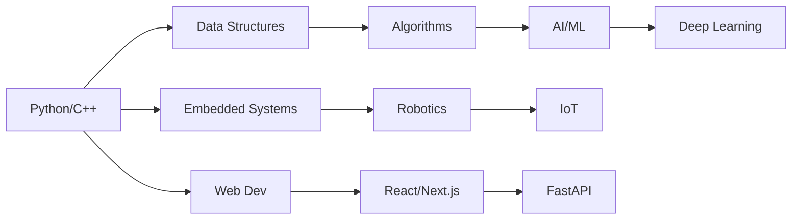

# 👋 Hi, I'm Pabitra Kumar Chalise

  

  
  

Welcome to my GitHub profile! I'm an engineering student from Nepal passionate about bridging the gap between software and hardware. I love building projects that combine practical engineering with real-world applications.

---

## 📌 About Me

<table>
  <tr>
    <td>
      <ul>
        <li>🎓 Engineering student balancing academics & projects</li>
        <li>💰 Managing expenses through tuition-based teaching</li>
        <li>🛠️ DIY enthusiast (FFB steering, CNC plotter, robotics)</li>
        <li>📈 Exploring AI & Machine Learning</li>
        <li>🧠 Integrating hardware with software solutions</li>
        <li>🎸 Guitar player & music composer</li>
        <li>🌍 Passionate about tech evolution</li>
      </ul>
    </td>
    <td align="center">
      
    </td>
  </tr>
</table>

---

## 👨‍🏫 Teaching Experience

- 📘 Teaching school-level **Mathematics** & **Science**
- 📚 Simplifying complex concepts for better understanding
- ⏱️ Balancing academics, work, and self-learning projects

---

## 🛠️ Technical Skills

### 💻 Programming Languages

### 🌐 Frontend Development

### ⚙️ Backend & APIs

### 🤖 Data Science & AI

### 🔌 Embedded Systems & IoT

### 🤖 Robotics & Electronics

### 🛠️ Tools & Platforms

---

## 📊 GitHub Stats

  
  

  

---

## 🔍 Areas of Interest

<table>
  <tr>
    <td align="center">
      
       <b>Embedded Systems</b>
    </td>
    <td align="center">
      
       <b>IoT & Robotics</b>
    </td>
    <td align="center">
      
       <b>AI & ML</b>
    </td>
    <td align="center">
      
       <b>Full-Stack Web</b>
    </td>
  </tr>
  <tr>
    <td align="center">
      
       <b>Automation</b>
    </td>
    <td align="center">
      
       <b>DevOps</b>
    </td>
    <td align="center">
      
       <b>Backend APIs</b>
    </td>
    <td align="center">
      🎼
       <b>Music Tech</b>
    </td>
  </tr>
</table>

---

## 🎯 Hobbies

  
⛰️ Trekking &nbsp;|&nbsp; 📸 Photography &nbsp;|&nbsp; 🎸 Guitar &nbsp;|&nbsp; 🧲 Electronics &nbsp;|&nbsp; 🎱 Pool &nbsp;|&nbsp; ⚽ Futsal &nbsp;|&nbsp; 🏍️ Motorbike

---

## 🚧 Featured Projects

| Project | Tech Stack | Status |
|---------|-----------|--------|
| 🚗 Force Feedback Steering Wheel | Arduino, C++, RS-775 Motor | 🚧 In Progress |
| 📈 Stock Market Simulator | Python, NumPy, Pandas | 🚧 In Progress |
| 🧼 Data Cleaning Pipeline | Python, Pandas | 🚧 In Progress |
| 🧩 Algorithm Practice | C++, Python | 📚 Active |
| 🛠️ Task Posting Platform | React, FastAPI, MongoDB | 📋 Planning |
| 🤖 Robotics Control System | ROS, Python, Arduino | 🚧 In Progress |

---

## 📚 Learning Journey

---

## 🎯 2026 Goals

- [ ] Master **FastAPI** for robust backend development
- [ ] Build **Next.js** full-stack applications
- [ ] Complete **Machine Learning** certification
- [ ] Develop a **Robotics** project with ROS
- [ ] Contribute to **Open Source**
- [ ] Build a **Portfolio** of 10+ projects
- [ ] Strengthen **Linear Algebra** & **Probability**

---

## 📫 Connect With Me

  
  
  

---

## 🏆 GitHub Trophies

  

---

  

---

> *"I focus on learning through building—transforming ideas into working systems, from code to circuits."*

---

  <i>🔗 Feel free to explore my repositories and collaborate on interesting projects!</i>
   
  <i>⭐ If you find my work interesting, consider starring a repository!</i>

---

## ✨ Recent Activity

<!--START_SECTION:activity-->
<!--END_SECTION:activity-->

---

**📝 Note**: This profile is actively maintained. New projects and skills are added regularly as I continue learning and building.
